# SephiriaMod

## 📌 概要

Team Horay の <a href="https://store.steampowered.com/app/2436940/_/">Sephiria</a> に50以上の新しいアーティファクトを追加する Mod です。

なお、一部のアーティファクトの画像は仮です。

## 📥 インストール
1. <a href="https://github.com/LavaGang/MelonLoader">MelonLoader v0.7.1</a> をSephiriaにインストールしてください。
2. Releases から最新の `SephiriaMod.zip` をダウンロードし、解凍してください。
3. `Program Files (x86)\Steam\steamapps\common\Sephiria\Mods` フォルダ内に `SephiriaMod.dll` を配置します。
4. `Program Files (x86)\Steam\steamapps\common\Sephiria\Mods` フォルダ内に `CustomImages`フォルダをコピーします。
5. `Program Files (x86)\Steam\steamapps\common\Sephiria\Sephiria_Data\StreamingAssets\Localization` フォルダ内に `ja-JP.json` を上書きコピーします。

```
Sephiria/
├── Mods/
│   ├── CustomImages/
│   └── SephiriaMod.dll
└── Sephiria_Data/
    └── StreamingAssets/
        ├── Costume/
        │   └── RainbowRabbit/
        └── Localization/
            ├── en-US.json
            └── ja-JP.json
```

6. ゲームを起動すると自動的に反映されます。

※翻訳ファイル（ja-JP.json）は Sephiria 本体の翻訳も含まれるので、異なるSephiriaのバージョンのものを上書きしてしまうと、Sephiria本体の翻訳が欠ける可能性があります。また、Sephiria本体の更新によって翻訳ファイルも更新され、Modの翻訳が消えることがあります。その場合、翻訳jsonファイルに手動でModの翻訳ファイルの必要箇所をコピペしてください。

## 🔧 主な要素

追加要素（2026年1月25日時点）

- コンボ効果 +5
- 普通アーティファクト +5
- 高級アーティファクト +10
- 希少アーティファクト +10
- 伝説アーティファクト +15
- 絆アーティファクト +16
- ジョーク石版 +2
- 奇跡 +7
- 武器強化先 +9

### ◆ 新コンボ：生命
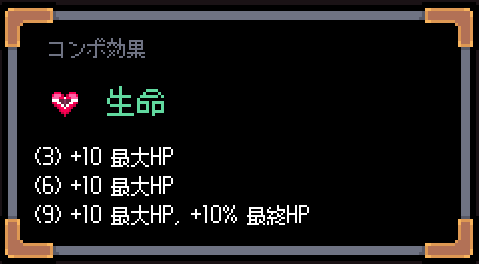

最大HPに関するコンボです。
HP回復や最大HP増加などの効果を持つアーティファクトが追加されます。

伝説アーティファクト、溢れる生命は最大HPに応じた追加ダメージを与えます。

また、生命の手、盾のイヤリング、スタールビーなどのいくつかのアーティファクトがこのコンボに変更されます。
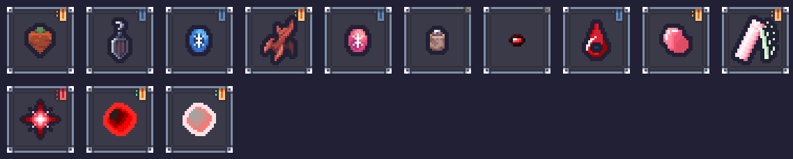

### ◆ 新コンボ：空の歌

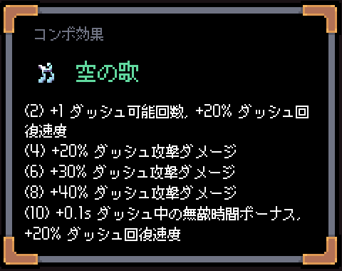

ダッシュに関するコンボです。
風の歌からダッシュに関するアーティファクトを分離させたコンボで、ダッシュ速度上昇やダッシュ回復、ダッシュ回数などの効果があります。

また、金色のマント、常緑のマント、突き指南書などのアーティファクトに空の歌が追加されます。

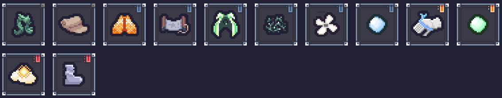

### ◆ 新コンボ：夜空

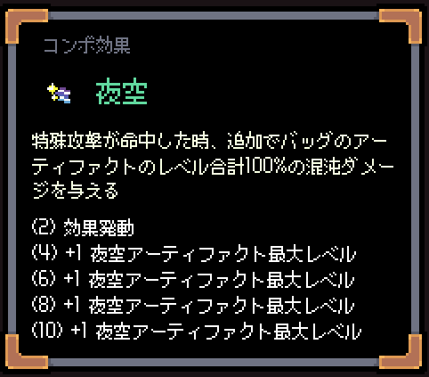

バッグのアーティファクトのレベル合計がそのまま攻撃力になる完全新規のコンボです。
コンボ効果では夜空アーティファクトの最大レベル（星の数）が増加します。

伝説アーティファクト、星見の石版は石版を壊すことでバッグの枠レベルを増加させる効果を持ちます。


### ◆ 新コンボ：酩酊

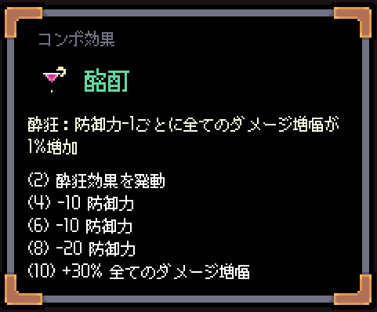

防御力がマイナスになるほど強くなる効果を持つコンボです。
コンボ効果では防御力-1につき、全てのダメージ増幅が1%増加します。

コンボ効果のダメージ増幅だけではあまり強くなく、他と組み合わせることで真価を発揮します。そのため、絆アーティファクトが多くあります。

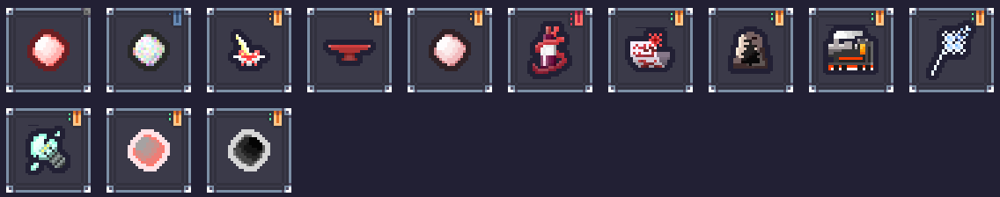

### ◆ 新コンボ：運命

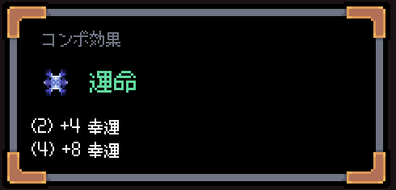

幸運に関するコンボです。

パラスのジョーカーは周囲のパラスのカードを強化します。元々は絆アーティファクトに設定していたのですが、 Sephiria 0.10.9 のアップデートによって不必要な絆アーティファクトが出やすくなってしまったため、パラスのカードを独立したコンボに変更しました。

パラスのカードで遊ぶためだけのコンボです。

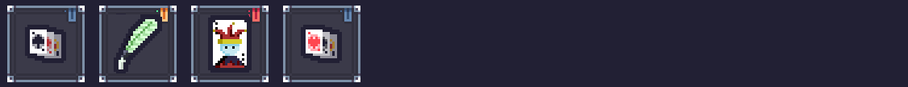

### ◆ アカデミーの改変

ほとんどのアカデミーアーティファクト（ライリーの懐中時計、空の剣の握りを含む）が非固有になります。

自動的に魔法を発動できるアーティファクト、
固有でないアカデミーアーティファクトを複製できるアーティファクト、
火属性ダメージを与えるたびにすべての魔導書のクールタイムを加速させる絆アーティファクトなどが追加されます。

ついでに、メテオシャワーが最大3レベルから最大8レベルに変わり、隕石の数が増え、短い時間にたくさん落ちるようになります。

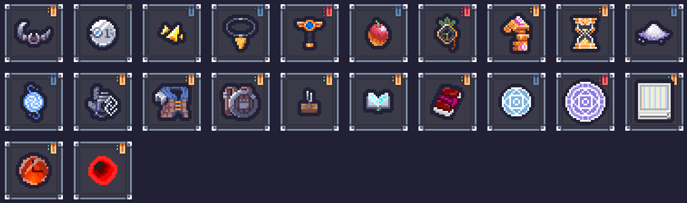

### ◆ 新しい伝説アーティファクト

呪いの伝説アーティファクト、血の入れ墨は通常攻撃ダメージが0になる代わりに、武器攻撃で傷の悪化を付与できます。異端審問官のためのアーティファクトです。

湖の伝説アーティファクト、水神の目はレベル2までは最大MPとMP再生が増加するエンドディットの文鎮の上位互換です。しかし、レベル3にするとMP再生が最終MPに変換されます。

仲間の伝説アーティファクト、友情のリストバンドは仲間が倒れるたびにプレイヤーのHPを上限を超えて数%回復します。

魔法工学の伝説アーティファクト、ビリビリクリームクロワッサンは感電を付与するたびに気絶を付与する確率が少しずつ増加します。ただし、気絶付与の効果は感電状態でない敵にしか効きません。

精密の伝説アーティファクト、ウリエルの手斧はもう一つのべルートの大鎌です。クリティカル確率が100%を超えると、処刑ではなく天罰が発生するようになり、最大で元の4倍のダメージを与えることができます。

### ◆ 新しい絆アーティファクト

アカデミーと元素の絆アーティファクト、元素学の写本は魔導書の数だけ属性ダメージが増加します。元素コンボが追加されたので絆に変えたアーティファクトです。

魔法工学と精密の絆アーティファクト、雷鳴の槌は雷属性ダメージの分だけクリティカル確率が増加します。

堅固と風の歌の絆アーティファクト、惜別のアレキサンドライトは一定以上のダメージの武器攻撃を2回に分割します。

氷の武具と影の絆アーティファクト、氷の簪は回避するたびに氷の遺物のチャージを1つだけ加速します。また、回避に基づいた確率で氷の遺物発動時に即時チャージします。

燠火と風の歌の絆アーティファクト、メテオライトの指輪は隕石（赤い蛇の目、メテオシャワーの隕石）の落下速度とダメージが増加します。

影と呪いの絆アーティファクト、暗黙の毒針は回避ができなくなる代わりに、回避に基づいた確率で、対象の最大HPの4% x 対象のデバフの数のダメージを与えます。

### ◆ 新しい奇跡

太陽剣、魔法工学の奇跡が追加されます。

また、防御貫通、バフの持続時間、復活可能回数、HP吸収、固定ダメージに関する奇跡が追加されます。

ついでにいくつかの奇跡のコンボが変更されます。
（学者：アカデミー→湖、元素術師：アカデミー→元素、警備兵：無し→生命、諜報員：無し→空の歌、狂戦士：無し→酩酊）

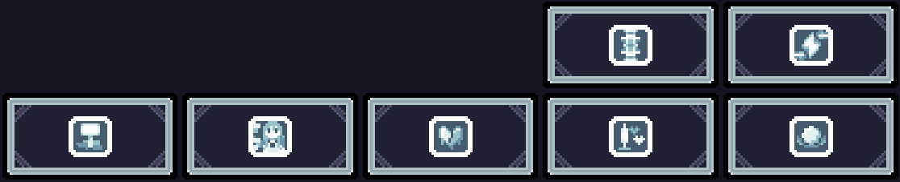

### ◆ 新しい武器強化

火属性の剣と盾、フューリーでMPを回復する短剣、フューリー可能な火属性短剣、もう一つの回避短剣、惑星ボーガン、氷の遺物・太陽剣の刀が追加されます。

※ Sephiria 0.10.9 によって変更された永遠の蝕の効果と氷の遺物・太陽剣の刀の効果が被ったため変更予定

※ Sephiria 0.10.9 によって魔法短剣が追加されたため、フューリーでMPを回復する短剣は削除予定（多分）

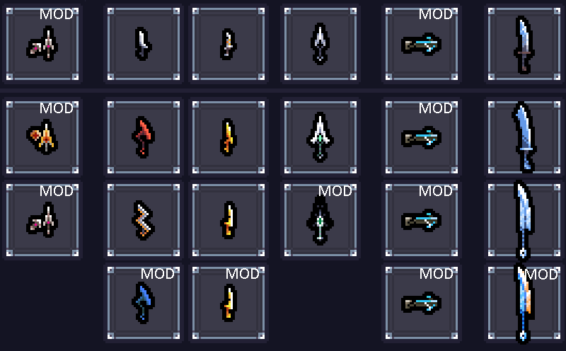

### ◆ その他の要素

- ジョーク石板が2つ追加されます。Mystic Potから出ると嫌なので出ないようにしてます（多分）。

## 📝 注意事項
- このリポジトリおよびその貢献者は、Sephiria、Team Horay、または関連団体とは一切関係がありません
- 他の Mod と競合する可能性があります
- マルチプレイで使用する場合は、ホストもクライアントも必ず全員がこのModをインストールする必要があります。全員の同意を得た上でプレイしてください。

## 備考
- ビリビリクリームクロワッサン、友情のリストバンド、劣化の原子時計などの一部のアーティファクトの画像は私の友人が描いたものです
- 一部のアーティファクトはマルチプレイで上手く動作しないことがあります。（主に非ホスト側でアーティファクトの説明文が正しく表示されないことが多い）
- レベル1以上の石版の欠片がバッグにある状態でセーブし、Sephiriaを再起動して、プレイを再開するとバッグの枠レベルが不正に増加したままになるバグがありますが、面倒なので修正せずに放置しています。
- <a href="https://github.com/Mira090/CustomCostume">Custom Costume Mod</a>は元々このModから分離させたModです。なので、そのソースコードがこのリポジトリにも残っています。